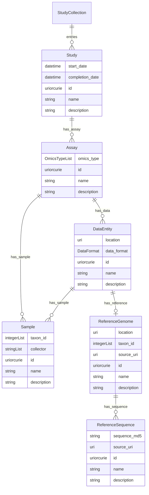

# smoc-schema

Metadata schema for the SMOC Multi-Omics Digital Object

## Website

[https://sdsc-ordes.github.io/smoc-schema](https://sdsc-ordes.github.io/smoc-schema)

## Repository Structure

* [examples/](examples/) - example data
* [project/](project/) - project files (do not edit these)
* [src/](src/) - source files (edit these)
  * [smoc_schema](src/smoc_schema)
    * [schema](src/smoc_schema/schema) -- LinkML schema
      (edit this)
    * [datamodel](src/smoc_schema/datamodel) -- generated
      Python datamodel
* [tests/](tests/) - Python tests

## Developer Documentation

Use the `make` command to generate project artefacts:

* `make all`: make everything
* `make deploy`: deploys site

## Credits

This project was made with
[linkml-project-cookiecutter](https://github.com/linkml/linkml-project-cookiecutter).
